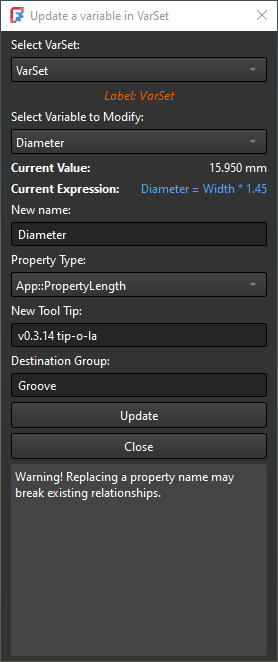

# VarSetUpdate

## Overview
`VarSetUpdate` is a FreeCAD macro designed to streamline the process of updating variable names and properties in VarSet objects. Originally authored by **Mathias L.** and extended by **[DesignWeaver](https://forum.freecad.org/memberlist.php?mode=viewprofile&u=80381&sid=658045436126114983df20117ee27bf5) (NSUBB)**, this utility provides a robust toolset for managing properties, ensuring compatibility with existing relationships, and simplifying modifications.

## Version History
- **v0.1**: Initial version by [Mathias L.](https://github.com/mathiaslec) originally shared in [this post](https://github.com/FreeCAD/FreeCAD/issues/16222#issuecomment-2754714033). This version provided basic functionality to update a variable name in VarSet.
- **v0.3.14**: Extended by [DesignWeaver](https://forum.freecad.org/memberlist.php?mode=viewprofile&u=80381&sid=658045436126114983df20117ee27bf5) (NSUBB) to include several advanced features and improvements:
  - Dropdown selection for VarSet and property names.
  - Display of current property values and associated expressions.
  - Prepopulation of fields with current property details for easier edits.
  - Support for custom group names when updating variables.
  - Ability to change property types (e.g., Length, Float, Angle).
  - Added tooltips for properties and improved UI design.
  - Enhanced error handling and transaction management for safe updates.
  - Backing up and restoring expressions across all document objects during updates.
  - Improved expression and constraint management to ensure all updates are reflected.

## Features
- **Interactive UI**: Intuitive graphical interface with dropdowns and input fields.
- **Customizable Groups**: Add new or change existing group for better organization.
- **Property Type Modification**: Change the type of a property dynamically (e.g., Length, Angle).
- **Tooltips**: Add new or change existing tooltip properties.
- **Expression Management**: Automatically updates all expressions and constraints referencing the old property.
- **Error Resilience**: Comprehensive error handling to manage and recover from issues during updates.

## How to Use
1. Run the macro in FreeCAD.
2. Select a VarSet from the dropdown.
3. Choose the variable you want to modify.
4. Edit any of the object properties in their respective fields (e.g., name, group or tooltip).
5. Click `Update` to apply changes.

> **Note**: This macro works by backing up, then deleting the existing VarSet property (variable), then restoring its data with edited attributes by creating a new VarSet property. Great care has been taken to ensure stable operation and thorough expression reference handling, but the process inherently may break existing relationships. Ensure all dependencies are reviewed post-update.

## Requirements
- **FreeCAD Version**: 1.0 or newer. During development, v1.1 b40971 was used and confirmed stable.

## Installation
1. Download the latest version of `VarSetUpdate` from [GitHub](https://github.com/NSUBB/VarSet-Update/tree/main).
2. Place the macro file in your FreeCAD `Macro` folder.
3. Launch FreeCAD and run the macro from the Macro menu.

## Acknowledgments
- **Original Author**: Mathias L. ([GitHub Profile](https://github.com/mathiaslec))  
  Initial concept and implementation of `VarSetUpdate` (v0.1).
- **Contributor**: [DesignWeaver](https://forum.freecad.org/memberlist.php?mode=viewprofile&u=80381&sid=658045436126114983df20117ee27bf5) (NSUBB)  
  Significant enhancements and feature extensions (v0.3.14).

## License
This project is distributed under the **CNU CPL v3.0**. See the LICENSE file for details.

---

For any issues or feature requests, please feel free to open an issue or contribute to the project.
